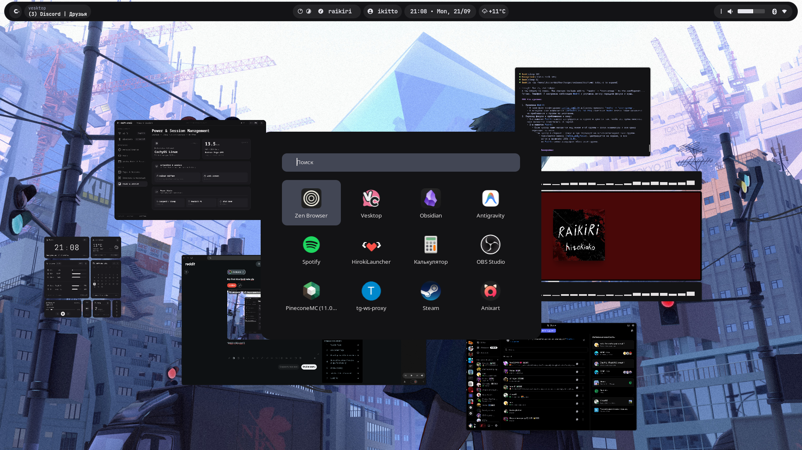
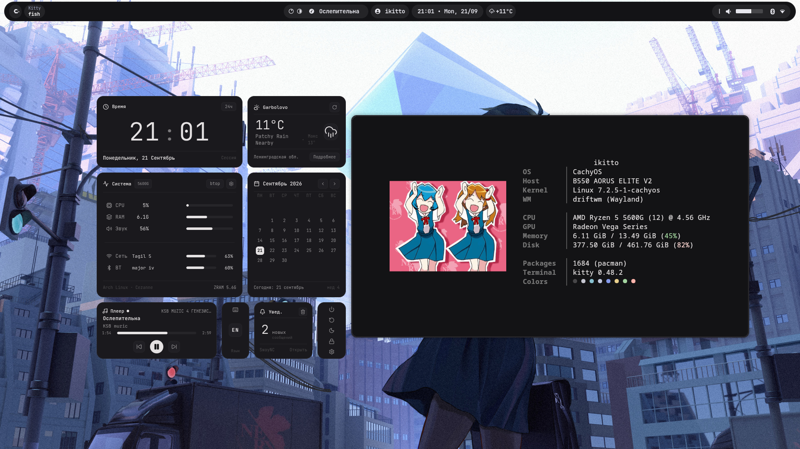
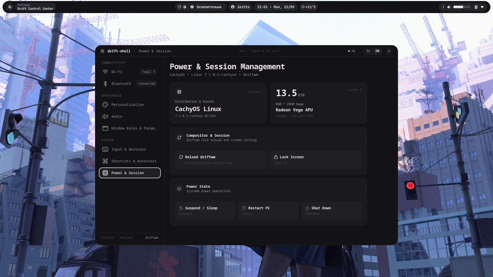
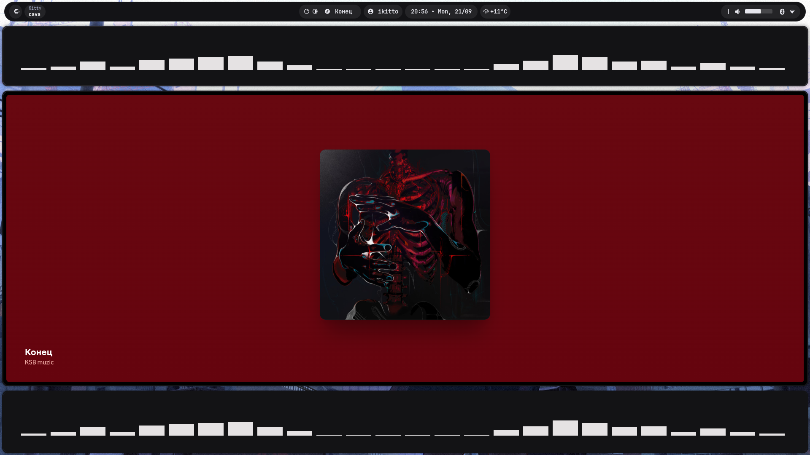
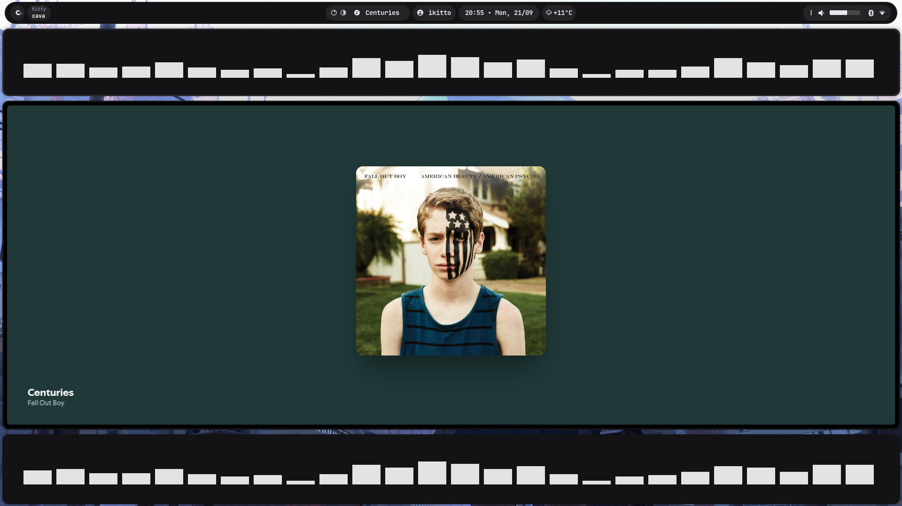
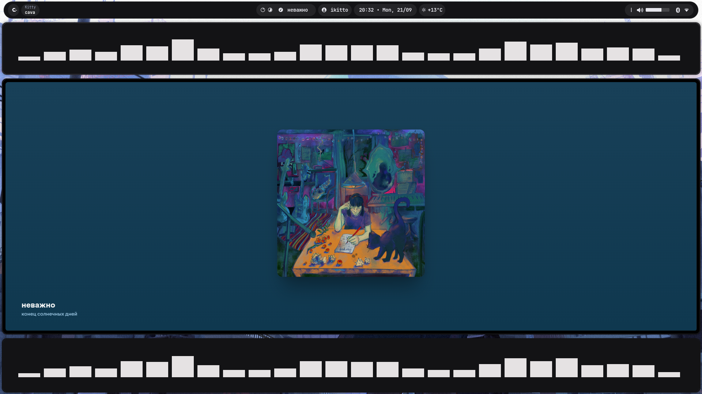

<p align="center">
  <pre align="center">
  __  __   _    _   _ 
 |  \/  | / \  | | | |
 | |\/| |/ _ \ | |_| |
 | |  | / ___ \|  _  |
 |_|  |/_/   \_\_| |_|
  <i>minimal · graphite · matcha · driftwm</i>
  </pre>
</p>

<p align="center">
  
  
  
  
  
</p>

<p align="center">
  <b>Минималистичные dotfiles для CachyOS с тайлинговым Wayland-композитором <a href="https://github.com/malbiruk/driftwm">driftwm</a>.</b><br/>
  <i>Глубокий графитовый фон, пастельные акценты (маття-зеленый, приглушенный фиолетовый, пыльно-розовый), скругленные окна без рамок и авторские Python-виджеты.</i>
</p>

---

## 🖼️ Скриншоты (Gallery)

<p align="center">
  
</p>

<p align="center">
  
  
</p>

<p align="center">
  
  
  
</p>

---

## 💻 Спецификация системы (System Specs)

| Компонент | Значение |
| :--- | :--- |
| **ОС (Distribution)** | **CachyOS** (оптимизированный Arch Linux) |
| **Ядро (Kernel)** | `Linux 7.1.8-1-cachyos` (компиляция под архитектуру, планировщик BORE) |
| **Оконный менеджер (WM)** | [driftwm](https://github.com/malbiruk/driftwm) (Wayland-композитор на бесконечном холсте) |
| **Процессор (CPU)** | AMD Ryzen 5 5600G with Radeon Graphics (6 ядер / 12 потоков, до ~4.56 ГГц) |
| **Видеокарта (GPU)** | AMD Radeon Graphics (архитектура Vega / Cezanne APU, драйвер `amdgpu`) |
| **Оперативная память (RAM)** | 16 GB DDR4 (~13.5 ГиБ доступно + 13.5 ГиБ ZRAM zram0) |
| **Накопитель (Storage)** | NVMe SSD 500 GB (Btrfs с сабволюмами `@`, `@home`, `@var_cache`) |
| **Эмулятор терминала** | [Kitty](https://sw.kovidgoyal.net/kitty/) |
| **Оболочка (Shell)** | [Fish shell](https://fishshell.com/) 4.7.1 |
| **Строка состояния (Bar)** | [Waybar](https://github.com/Alexays/Waybar) |
| **Виджеты** | Собственные Python GTK-виджеты (`widgets/`) |
| **Центр управления** | [drift-shell-settings](https://github.com/ikittohk14-beep/drift-shell-settings) |
| **Системный инфо-фетчер** | [ikifetch](https://github.com/ikittohk14-beep/ikifetch) |
| **Шрифт** | Inter Nerd Font / JetBrainsMono Nerd Font |

---

## 🎨 Философия дизайна (Design Concept)

- **Палитра:** Глубокий графитовый фон без размытий и прозрачности (`#131316`). Пастельные акценты: маття-зеленый (`#a3d4a0`), приглушенный фиолетовый (`#859aea`), пыльно-розовый и спокойный голубой.
- **Геометрия окон:** Borderless & Rounded — отказ от классических рамок и заголовков. Аккуратные карточки со скругленными углами.
- **Типографика:** Моноширинный шрифт, жесткая сетка и тонкие разделители (`|`).
- **Графический минимализм:** Текстовая ASCII-эстетика и аккуратные цветные индикаторы в терминальной палитре.

---

## 📦 Включенные компоненты (Components & Links)

- **[ikifetch](https://github.com/ikittohk14-beep/ikifetch)** — быстрый, легковесный системный фетчер на Python с поддержкой анимированных GIF и кэшированием кадров в терминале Kitty.
- **[drift-shell-settings](https://github.com/ikittohk14-beep/drift-shell-settings)** — современная панель настроек для driftwm с интерактивным управлением Wi-Fi, Bluetooth, звуком PipeWire, обоями и правилами окон.
- **`driftwm/`** — конфигурация композитора (`config.toml`), скрипты запуска XWayland и сервисов.
- **`waybar/`** — кастомная верхняя панель в стиле pill-док с медиаплеером, погодой, статусом CPU/RAM и системным треем.
- **`widgets/`** — набор автономных виджетов (часы, календарь, монитор ресурсов, погода, меню выключения).
- **`kitty/`** — профиль терминала со шрифтом `Inter Nerd Font` и монохромно-пастельной темой.
- **`fish/`** — функции интеграции `ikifetch`, алиасы и окружение.
- **`swaync/` & `swayosd/`** — стилизованный центр уведомлений и индикаторы громкости/яркости.
- **`rofi/`** — меню приложений в единой графитовой палитре.

---

## 🚀 Установка (Installation)

### 1. Клонирование репозитория
```bash
git clone https://github.com/ikittohk14-beep/dotfiles.git
cd dotfiles
```

### 2. Зависимости (CachyOS / Arch Linux)
```bash
# Базовые пакеты и утилиты
sudo pacman -S waybar kitty fish rofi swaync swayosd python python-pillow btop yazi micro git stow

# Drift Shell Settings и ikifetch
git clone https://github.com/ikittohk14-beep/ikifetch.git && cd ikifetch && ./install.sh && cd ..
git clone https://github.com/ikittohk14-beep/drift-shell-settings.git
```

### 3. Развертывание через GNU Stow
```bash
stow driftwm
stow waybar
stow widgets
stow kitty
stow fish
stow ikifetch
stow rofi
stow swaync
stow swayosd
```

---

## ⌨️ Основные горячие клавиши (Keybindings)

| Комбинация | Действие |
| :--- | :--- |
| `Super + Enter` | Терминал Kitty |
| `Super + D` | Меню приложений (Rofi) |
| `Super + G` | Проводник Nautilus |
| `Super + N` | Центр уведомлений (SwayNC) |
| `Super + Shift + D` | Переключение темы |
| `Super + L` | Блокировка экрана |
